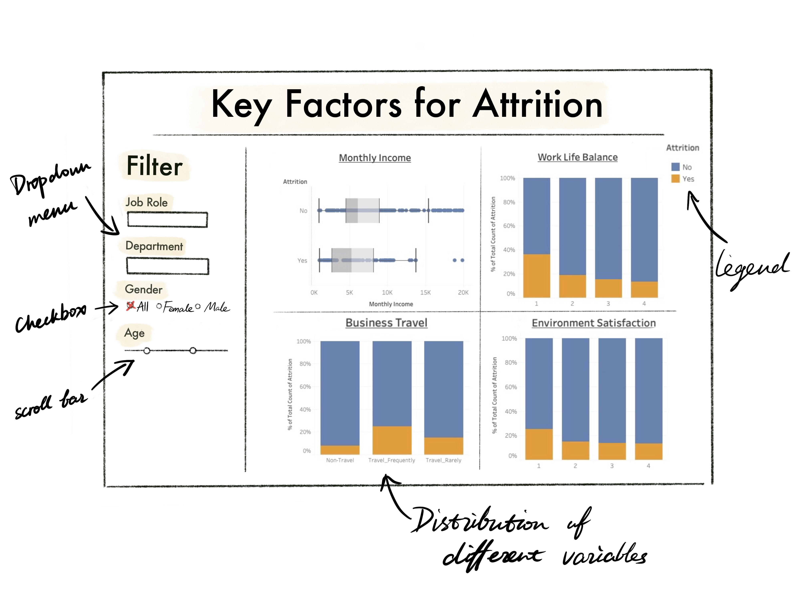

# IBM Employee Attrition Analytics
- Author: DSCI 532 Group14
- Group Member: Cheuk Ho, Hazel Jiang, Anita Li, Ivy Zhang

## Motivation and Purpose

Our role: Data Analyst in HR within IBM

Target audience: IBM Management Team

Companies usually spend a large amount of money on training new employees every year. Whenever there is a turnover, it is costly to  go through the hiring and training process. It is very useful to uncover the factors contribute to employee attrition. To address this challenge, we propose building a data visualization app that offers the management to visually explore the dataset regarding employee attrition to identify important factors. Our app will show the key factors that related employee attrition and allow users to filter different variables in order to better explore and compare the segments that lead to attrition.

## Description of the Data

We will be visualizing a dataset of the survey result of approximately 1470 employees. Each result (an employee) has 35 associated variables that describe their demographics (e.g. `age`, `gender`, `marital status`), their roles within the company (e.g. `department`, `job title`, `job level`, `total working year`), their compensation and working status(e.g. `monthly income`, `provision of training (time)`, `frequency of business travel`, `level of work life balance`) and their attitudes toward the company (e.g. `job satisfaction`, `environment satisfaction`, `relationship satisfaction`). There is quite a good mix of numerical and categorical variables. Having conducted a EDA in looking for key factors for attrition, we found that `monthly income`, `level of work level balance`, `frequency of business travel` and `environment satisfaction` seem to be the more prominent factors for attrition. We will used them as the KPIs for the dashboard app.

## Research Questions and Usage Scenarios

Joel is a member of management team in IBM and he wants to understand what factors are more likely attribute to employee attrition in order to devise the next step in coming up with a retention plan, particular for the segment with higher risk in attribution. He would want to explore the survey result of a employee satisfaction survey in order to identify the likelihood of attrition among different variables and potential figure out the employee segment to formulate initial idea of the retention plan and prioritize resource toward to high risk employee segment. 

When Joel logs on to the "IBM Employee Attrition Analytics Dashboard", he will see a KPIs overview with 4 prominent factors for attrition. He can then filter out variables such as employees' `department`, `job role`, `gender` and `age` to to identify the employee segment that are more likely affected by these 4 key factors. When he does so, Joel may notice that female employees in Sales team with low level of work level balance seems having a higher likelihood in resigning. He may decide to conduct follow up in-depth interviews with employee from this segment to further investigate the reasons behind the low level of work life balance and come up with meaures to reduce the likelihood of retention since these in-depth reasons are not captured in the current dataset.

Dashboard Sketch:

  
## License
IBM Employee Attrition Analytics materials here are licensed under the Creative Commons Attribution 2.5 Canada License (CC BY 2.5 CA). If re-using/re-mixing please provide attribution and link to this webpage.

## References

Saishruthi Swaminathan, Richard Hagarty. “Data science process pipeline to solve employee attrition”, Data Science Community, IBM. https://developer.ibm.com/patterns/data-science-life-cycle-in-action-to-solve-employee-attrition-problem/#description.
